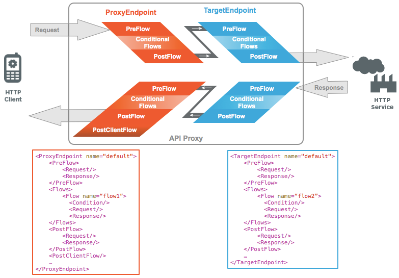

## APIGEE Features
* Create policies to adminster quotas
* Authorize users
* Charge for usage of APIs
* Enforce limit on usage
* Protect against security threats
* Make end points easily available for access using REST/SOAP and other protocols with minimal effort
* Create, Deploy, Undeploy API protocols using APIGEE Edge
* API Proxies primary mechanimsm for checking and enforcement of policies and has complext internal architecure like `target end points, and `proxy end points`

## What is APIGEE
* API management platform helping to expose APIs in a secure way
* Help expose APIs in secure way
* APIGEE Edge
	* product allows us to secure, deploy, monitor and scale APIs
	* configure, manage APIs separately from backend services
	* Create API Proxies which act as Facade to backend services
* Can Secure, Monitize, Analytics on APIs

## 	API Proxy
* Program that sits in front of API and proxies incoming user requests to the API and provides various value added features
* Secure API Calls
* Secure data

## API Product
* A collection of API resources (URLs) with quota (service plan) and protected by an API key

## API Package
* Group of API products monetize together as a bundle

## Types of end points
* ProxyEndPoint
	* Define how client apps can consume APIs
	* This is the end point that is directly accessible to users of API
* TargetEndPoint
	* Define how the API proxy interacts with backend services
	* when request comes, it first hits ProxyEndPoint then move on to the TargetEndPoint. Response move from TargetEndPoint to ProxyEndPoint

