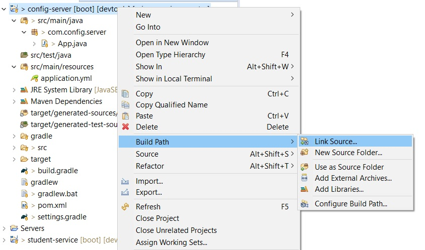
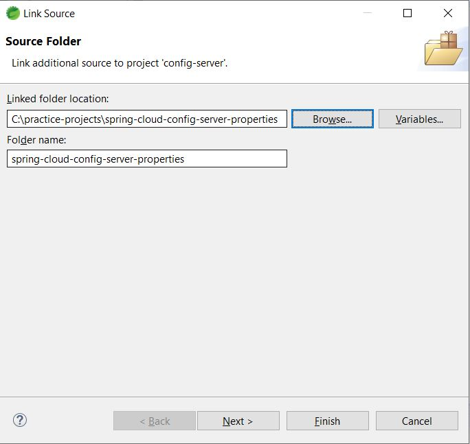
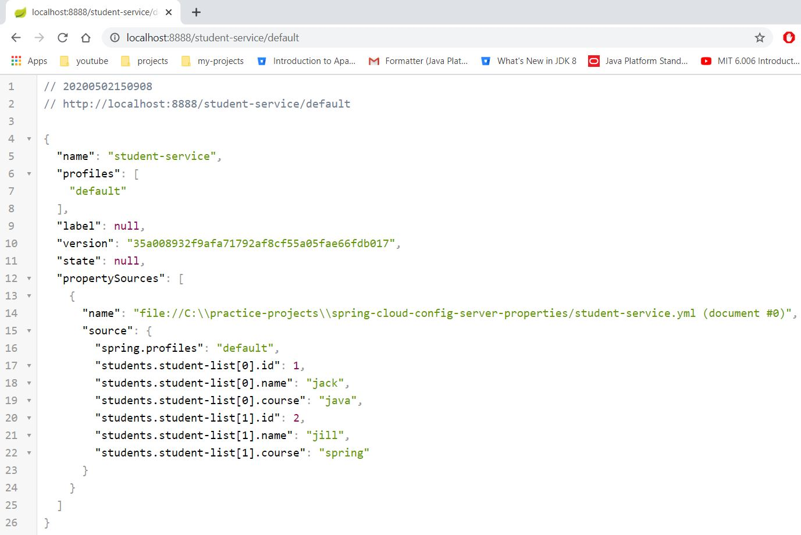

# Microservice example 1

## Requirement
* Create student service spring boot application
* Create spring cloud config server spring boot applicaiton
* Make student service as spring cloud config client
* Get configuration properties in student service from spring cloud config client by environment

## Postman Collection
* Import postman collection json to local postman - [example-1.postman_collection.json](files/example-1.postman_collection.json)

## Student Service
* Project folder - [student-service](student-service)
* Maven Command
```
mvn archetype:generate -DgroupId=com.student.service -DartifactId=student-service -Dversion=1.0 -DarchetypeArtifactId=maven-archetype-quickstart -DinteractiveMode=false
```
* Gradle command
```
gradle init --type pom
```
* Main class - [App.java](student-service/src/main/java/com/student/service/App.java)
* Add spring-boot, devtools, actuator, `spring-cloud-config-client`, `spring-boot-configuration-processor` dependencies. Refer [pom.xml](student-service/pom.xml) (or) [build.gradle](student-service/build.gradle)
* Create [student-service/bootstrap.yml](student-service/src/main/resources/bootstrap.yml) file. Configure following properties
	* server.port
	* spring.application.name
* Application is running on port - `9000`. Refer [bootstrap.yml](student-service/src/main/resources/bootstrap.yml) - `server.port` property
* Create [Student.java](student-service/src/main/java/com/student/service/model/Student.java)
* Create [StudentList.java](student-service/src/main/java/com/student/service/model/StudentList.java)
	* Declare `@ConfigurationProperties(prefix = "students")` at class level to enable to declare values for properties of this class in properties/yaml file
* Create [AppConfig.java](student-service/src/main/java/com/student/service/config/AppConfig.java). This class to enable configuring [StudentList.java](student-service/src/main/java/com/student/service/model/StudentList.java) class properties in properties/yaml file
* Create [AppController.java](student-service/src/main/java/com/student/service/controller/AppController.java)
	* Inject [StudentList.java](student-service/src/main/java/com/student/service/model/StudentList.java)
	* Write `/students` API - `findAllStudents()`

## Config Server
* Project folder - [config-server](config-server)
* Maven command
```
mvn archetype:generate -DgroupId=com.config.server -DartifactId=config-server -Dversion=1.0 -DarchetypeArtifactId=maven-archetype-quickstart -DinteractiveMode=false
```
* Gradle command
```
gradle init --type pom
```
* Add spring-boot, devtools, actuator, `spring-cloud-config-server`, `spring-boot-configuration-processor` dependencies. Refer [pom.xml](config-server/pom.xml) (or) [build.gradle](config-server/build.gradle)
* Main class - [App.java](config-server/src/main/java/com/config/server/App.java)
* Create [applicaiton.yml](config-server/src/main/resources/application.yml). Configure following properties
	* server.port
	* spring.application.name
* Application is running on port - `8888`. Refer [applicaiton.yml](config-server/src/main/resources/application.yml) - `server.port` property
* Create git repo to configure all our properties for each microservice. Refer [spring-cloud-config-server-properties](https://github.com/avinashbabudonthu/spring-cloud-config-server-properties)
	* Clone this repo to local
	* Link this repo folder to our `config-server` project
		* In eclipse - right click on `config-server` - Build Path - Link Source
		* Browse to above cloned `spring-cloud-config-server-properties` folder




* Create [student-service.yml](https://github.com/avinashbabudonthu/spring-cloud-config-server-properties/blob/master/student-service.yml) in `spring-cloud-config-server-properties` which is linked to `config-server` project
* Commit and push the changes of `spring-cloud-config-server-properties`
* Connect `config-server` to local `spring-cloud-config-server-properties`
	* Open [config-server/applicaiton.yml](config-server/src/main/resources/application.yml). Add following property
		* spring.cloud.config.server.git.uri: file://C:\practice-projects\spring-cloud-config-server-properties
	* Add `@EnableConfigServer` at class level to [App.java](config-server/src/main/java/com/config/server/App.java)
	* Start the application
	* Open URLs in browser
		* http://localhost:8888/student-service/default
		* http://localhost:8888/student-service/dev
		* http://localhost:8888/student-service/test



## Connect Student Service to Config Server
* Open [student-service/bootstrap.yml](student-service/src/main/resources/bootstrap.yml) file. Configure following properties
	* spring.cloud.config.uri: http://localhost:8888
	* spring.profiles.active: test
* Start `config-server`. Run [App.java](config-server/src/main/java/com/config/server/App.java)
* Start `student-service`. Run [App.java](student-service/src/main/java/com/student/service/App.java)
* Access API - `example-1/student-service/app/find-all-students` in postman collection - [example-1.postman_collection.json](files/example-1.postman_collection.json)
```
{
    "studentList": [
        {
            "id": 5,
            "name": "james",
            "course": "spring-aop"
        },
        {
            "id": 6,
            "name": "jeni",
            "course": "spring-cloud"
        }
    ]
}
```
* Stop `student-service`
* Change `spring.profiles.active` property value from `test` to 'dev` in [student-service/bootstrap.yml](student-service/src/main/resources/bootstrap.yml)
* Start `student-service`. Run [App.java](student-service/src/main/java/com/student/service/App.java)
* Access API - `example-1/student-service/app/find-all-students` in postman collection - [example-1.postman_collection.json](files/example-1.postman_collection.json)
	* http://localhost:9000/students
```
{
    "studentList": [
        {
            "id": 3,
            "name": "john",
            "course": "jee"
        },
        {
            "id": 4,
            "name": "jane",
            "course": "spring-boot"
        }
    ]
}
```
* Stop `student-service`
* Change `spring.profiles.active` property value from `dev` to 'default` in [student-service/bootstrap.yml](student-service/src/main/resources/bootstrap.yml)
* Start `student-service`. Run [App.java](student-service/src/main/java/com/student/service/App.java)
* Access API - `example-1/student-service/app/find-all-students` in postman collection - [example-1.postman_collection.json](files/example-1.postman_collection.json)
	* http://localhost:9000/students
```
{
    "studentList": [
        {
            "id": 1,
            "name": "jack",
            "course": "java"
        },
        {
            "id": 2,
            "name": "jill",
            "course": "spring"
        }
    ]
}
```