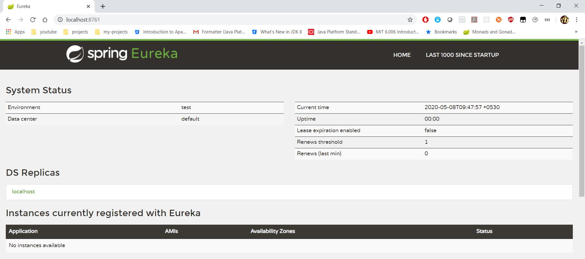
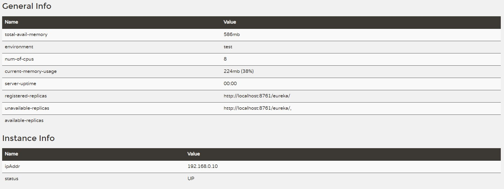

# Feign Euerka Example

## Eureka Server
* Create project using maven
```
mvn archetype:generate -DgroupId=com.eureka.server -DartifactId=eureka-server -Dversion=1.0 -DarchetypeArtifactId=maven-archetype-quickstart -DinteractiveMode=false
```
* Add gradle also. Execute below command from `eureka-server` project created above
```
gradle init --type pom
```
* Add following dependency management entry
```
<dependencyManagement>
	<dependencies>
		<dependency>
			<groupId>org.springframework.cloud</groupId>
			<artifactId>spring-cloud-starter-parent</artifactId>
			<version>Greenwich.RELEASE</version>
			<type>pom</type>
			<scope>import</scope>
		</dependency>
	</dependencies>
</dependencyManagement>
```
* Add following dependency
```
<dependency>
	<groupId>org.springframework.cloud</groupId>
	<artifactId>spring-cloud-starter-netflix-eureka-server</artifactId>
</dependency>
```
* Make application eureka server. Add `@EnableEurekaServer` annotation in the main class [App.java](eureka-server/src/main/java/com/eureka/server/App.java)
* Refer [pom.xml](eureka-server/pom.xml) or [build.gradle](eureka-server/build.gradle)
* Add following entry in [application.yml](eureka-server/src/main/resources/application.yml)
```
server.port: 8761 # default port for eureka server

eureka:
  client:
    register-with-eureka: false #built-in Eureka Client not to register with ‘itself' because our application should be acting as a server
    fetch-registry: false
```
* Start application. Execute main class [App.java](eureka-server/src/main/java/com/eureka/server/App.java)
* Open url - http://localhost:8761

